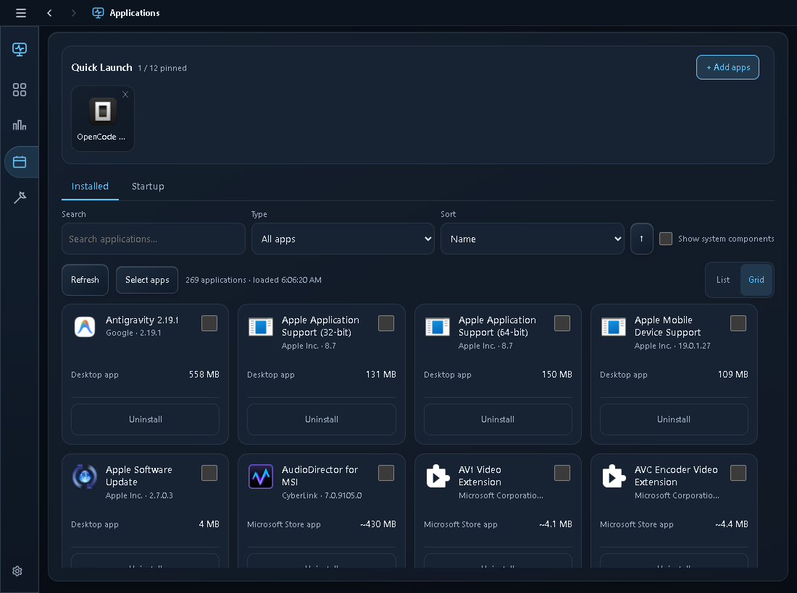
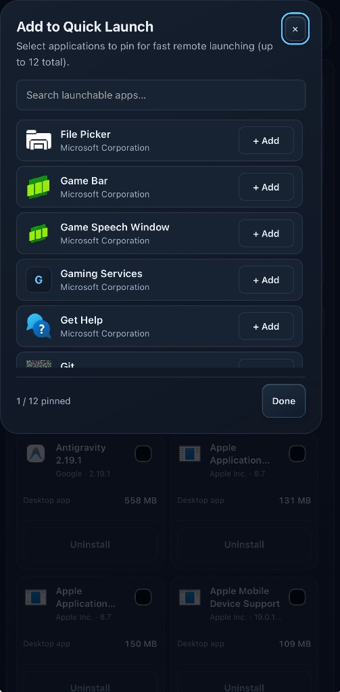
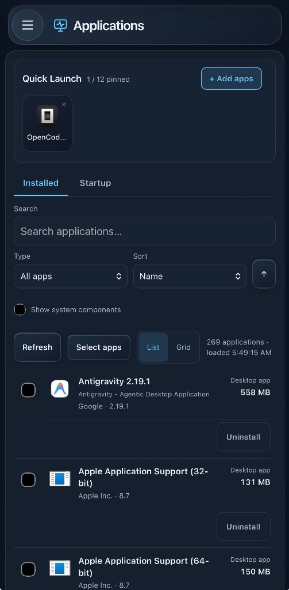

<div align="center">


# Rovarin

**Your PC in your pocket.**


[**Download for Windows**](https://github.com/DontMovePlease/Rovarin/releases/download/v0.3.0/RovarinSetup.exe) · [Release notes](https://github.com/DontMovePlease/Rovarin/releases) · [Website](https://rovarinofficial.com/) · [Report a bug](https://github.com/DontMovePlease/Rovarin/issues/new/choose)

</div>

Rovarin is a Windows PC monitoring and system-management app. Check CPU, GPU, memory and network activity, manage running processes, launch your apps, and uninstall supported software—all from a native Windows desktop app or your phone through Tailscale.

**Experimental alpha:** useful for testing and code review, with compatibility and clean-machine validation still in progress. The installer is unsigned. This is not a production-ready release.


<sub>Desktop Overview capture. Readings show total PC usage, not Rovarin's own resource usage; hardware and load vary by machine.</sub>

## What it does

| Area | Features |
| --- | --- |
| Overview | CPU and per-core load, RAM, storage capacity, network throughput, latency, and uptime |
| GPU | NVIDIA utilization, VRAM and temperature when nvidia-smi is available |
| Focused views | Larger graphs and faster sampling only for the active view |
| Processes | Live application groups, search, sorting, Pause/Resume, confirmed End task and separate verified process-tree control |
| Applications | Quick Launch with app discovery/pinning, installed app search, List/Grid views, readable sizes and PIN-confirmed uninstallation |
| Maintenance | Fixed Windows cleanup/repair actions with live logs, results and history |
| Diagnostics | Optional-tool/hardware availability, temperature status and a copyable compatibility report |
| Desktop | Native Windows shell, tray integration, saved window bounds and optional startup at sign-in |
| Remote access | Responsive browser interface over your own Tailscale network |

### Only collect data when there is a reason

No active monitoring lease means no continuous telemetry sampling. A visible dashboard uses modest baseline sampling; focused views request faster sampling for their relevant metrics. Closing or backgrounding a client releases or expires its lease.

One Node backend. One vanilla HTML/CSS/JS frontend. The native desktop renders that same served frontend through WebView2; mobile uses it through a browser. There are **zero npm runtime dependencies**.

## App launcher and uninstaller

### Quick Launch — your PC's apps, a tap away

Open **Applications → + Add apps**, search the apps Windows knows about, and pin up to 12 favorites. Launch a pinned app on your PC from the desktop interface or an authenticated phone connected through Tailscale.

Quick Launch uses locally registered applications. It does not accept arbitrary commands or executable paths from the browser. App availability depends on its Windows registration and the current user account.

### Installed applications — find it, review it, remove it

Browse your installed apps in **List or Grid** view. Search by name, filter by type, and sort by name, publisher or size. Sizes use readable MB/GB units where Windows provides them.

- **Uninstall one app:** review the exact application and confirm with your Rovarin PIN.
- **Remove several:** select only apps with a supported batch handler, review the full selection, then run them one at a time.
- **Know what happened:** see per-app results, failures and reboot-required states. Unsupported uninstallers remain manual-only.

Vendor uninstallers may require interaction or local Windows administrator approval. Removing an app can also remove its data; Rovarin follows the app's own supported uninstall mechanism.



<table>
<tr><th>Pin apps from your phone</th><th>Browse and uninstall apps</th></tr>
<tr><td align="center"></td><td align="center"></td></tr>
</table>

<sub>Existing Rovarin website screenshots, reused here unchanged. Installed apps and available actions vary by PC.</sub>

## Install on Windows

**Requirements:** Windows 11 x64, a standard Windows user account, and Microsoft's WebView2 Runtime. The Node.js runtime is bundled; no separate Node/npm installation is needed. If WebView2 is missing, the app links to Microsoft's official runtime installer.

1. Download **RovarinSetup.exe** under **Assets** on the [newest published release](https://github.com/DontMovePlease/Rovarin/releases). Do not use GitHub's source ZIP as the installer.
2. Run it under the Windows account that will use Rovarin. The unsigned installer may trigger SmartScreen; inspect the source/release and checksum before deciding whether to run it. No signing or reputation guarantee is claimed.
3. Choose whether to start Rovarin with Windows. This is enabled by default and runs the backend quietly at sign-in, without a Windows service or scheduled task.
4. Optional **Enhanced CPU Temperature** installs the signed PawnIO driver through Windows UAC. You may skip it; Rovarin remains usable without CPU temperature.
5. Leave **Launch Rovarin** checked. Setup displays your newly generated PIN. Keep it private, then choose **Finish / Open Rovarin** and sign in.

Normal Desktop and Start Menu shortcuts are named **Rovarin** and open Rovarin.exe. You do not need the repository's developer .bat files.

### Upgrading an earlier installation

Run the Rovarin installer normally. It recognizes the legacy PC Monitor installation,
preserves your PIN, security preferences, desktop trust and temperature settings,
and moves them to `%LOCALAPPDATA%\Rovarin\data`. Its existing trusted uninstaller
removes the old application; legacy settings are removed only after the new server
and copied settings are verified. Unknown user files are retained. Do not manually
delete your previous configuration or install a second copy to change the name.

### Connect your phone or another device

Local desktop use works **without Tailscale**. Tailscale is required for secure remote access in this release and is **not bundled**.

1. Install [Tailscale on this PC](https://tailscale.com/download/windows) and on the other device.
2. Sign both devices into the same Tailscale network.
3. In Rovarin Setup, select **Re-check Tailscale**. Once connected, copy the device address or scan its QR code.
4. Open that address in the other device's browser and enter your Rovarin PIN.

The address uses your PC’s detected Tailscale IPv4 address and active Rovarin port. Rovarin prefers port 7331 and automatically falls back to 7332–7335 if needed. The PIN is never included in the URL. On supported mobile browsers, you can add Rovarin to your Home Screen for quick app-like access.

If Tailscale is missing or disconnected, Setup explains the next step. You can finish and use Rovarin locally first. Do not forward this HTTP port through a router or expose it publicly.

## PIN, desktop behavior and recovery

- Fresh PINs have six cryptographically random digits. Existing twelve-digit PINs remain supported on upgrade.
- Valid sessions last up to 90 days, so normal use does not require daily login. Sessions are in memory; a backend restart requires sign-in again.
- **Settings → Security → Lock** revokes access. Local native Settings also provides **Generate New PIN**, which signs out all devices.
- PIN prompts on the native desktop are on by default. You may explicitly disable them for this Windows account; other devices still require the PIN. Native sign-in uses Windows-protected trust and ordinary revocable sessions, not unauthenticated APIs.
- Forgotten PIN? Open **Rovarin Setup and PIN Recovery** from the Start Menu. Recovery is local only; there is no remote PIN recovery endpoint.
- Alt+F4/system close hides to the tray. **Exit Desktop App** or the native top-right X closes only the shell. The backend remains available remotely. Minimized/hidden clients stop requesting dashboard telemetry.

## Optional temperatures and compatibility

GPU temperature comes from nvidia-smi independently of CPU temperature. Non-NVIDIA systems remain usable, but this release does not provide equivalent GPU telemetry for every vendor.

CPU temperature has three modes in Diagnostics:

- **Enhanced:** the approved CPU-only LibreHardwareMonitor provider and signed PawnIO support. Hardware/provider/permissions may still make readings unavailable.
- **System Thermal Zone — Advanced / Experimental:** a firmware zone, **not CPU package temperature**. It is never substituted automatically and does not trigger CPU temperature alerts.
- **Off:** disables CPU temperature collection.

Missing optional tools or sensors do not make Rovarin unhealthy. Temperature labels are informational thresholds, not a guarantee against throttling or hardware damage.

## Safety and privacy

PIN/session authorization protects the APIs, SSE, monitoring leases, maintenance and process actions. The server rejects non-loopback/non-Tailscale source addresses and uses origin checks, security headers, bounded commands and action allowlists.

Authenticated users can run maintenance and end a selected process. End Task verifies **PID + name + start time** and terminates the same held Windows process handle. It does not terminate a whole process tree or prevent an application from respawning. Some maintenance actions require elevation or change Windows state; read their confirmation first. Run normally as a standard user.

Tailscale reachability is not authentication. Rovarin currently serves HTTP; Tailscale encrypts remote device-to-device traffic, but local HTTP is not TLS. Restrict your tailnet to trusted devices. The source filter accepts address ranges; it does not cryptographically establish the receiving interface. PIN protection does not defend against compromise of the Windows account that owns the configuration.

**Security findings:** use [private vulnerability reporting](https://github.com/DontMovePlease/Rovarin/security/advisories/new), not a public issue containing exploit details. Include the affected version, impact and a minimal reproduction without credentials. Security review covers this experimental candidate; there is no guaranteed response time or established older-version support.

The installer contains application/runtime files and required third-party assets/licenses. It does **not** contain a developer PIN, local configuration, credentials, private Tailscale address, logs, runtime state or AGENTS.md. Each fresh installation generates its own configuration and PIN.

## Upgrade or uninstall

The unreleased development build adds **Settings → Updates** in the trusted native desktop app. Automatic checks are on by default (at startup and at most daily); installation always needs your approval. Experimental Alpha checks published official prereleases and full releases, choosing the highest valid numeric version with a verified installer checksum. The centralized Stable policy excludes prereleases and will be reviewed before Beta/V1. Remote browsers can view the installed version but cannot configure or execute updates. Source checkouts cannot upgrade themselves.

Run a newer installer over the existing installation to preserve your PIN and preferences. Use **Windows Settings → Apps → Installed apps → Rovarin → Uninstall** for normal removal.

Uninstall preserves settings by default. Explicit **Full removal** also removes Rovarin's PIN/configuration and preferences, so reinstall generates a new PIN. Shared PawnIO and Tailscale are not removed. Installed copies also offer an authenticated, PIN-confirmed uninstall in Diagnostics; source checkouts cannot use it.

## Testing status and feedback

Release verification requires eight regression suites plus isolated real Windows install/upgrade/uninstall/reinstall checks before promotion. Native WebView2, authentication, SSE, monitoring leases and optional-tool degradation are covered locally.

Still outstanding: broader clean Windows Home/Pro and standard/admin coverage, physical mobile interaction/connectivity, actual Windows sign-in startup, optional driver/UAC/reboot outcomes, and sensor compatibility across more hardware. Short local process measurements do not establish aggregate or long-duration resource costs.

Please [report reproducible bugs](https://github.com/DontMovePlease/Rovarin/issues/new/choose) with your Windows version, Rovarin version, steps and a reviewed **Diagnostics → Copy report**. Remove private addresses and other personal details. Never post PINs, cookies or credentials. Share security vulnerabilities through [private reporting](https://github.com/DontMovePlease/Rovarin/security/advisories/new).

## Inspect, build or modify

The current source is available for inspection and noncommercial modifications. Runtime, frontend and native-shell sources are in this repository; no separate desktop dashboard is maintained. Personal planning and coding-agent documents are kept local.

<details>
<summary>Development, testing and contributions</summary>

On Windows with a supported Node LTS installed, run `npm run dev` from the source checkout. Leave its watcher running while editing; do not also run `Start Dashboard.bat`. Configuration/PIN is generated locally and must remain untracked. Browser access to the printed localhost address is available for development, with ordinary authentication. After building the packaging payload, `Desktop Dashboard.bat` builds/opens the native source preview.

| Location | Responsibility |
| --- | --- |
| `server.js` | HTTP, authentication, leases/profiles, centralized samplers, SSE and APIs |
| `public/` | Canonical desktop/mobile frontend |
| `packaging/DesktopShell.cs` | Thin native WebView2 shell |
| `scripts/*-smoke-test.js` | Plain Node regression suites and isolated fixtures |
| `packaging/Rovarin.iss` | Per-user Inno installation/uninstall |

Keep changes focused. Preserve adaptive monitoring, authentication, process identity/handle checks, lifecycle ownership and zero npm runtime dependencies. Never add independent telemetry loops or client-supplied commands. Discuss significant changes in an issue first; submit only code you have permission to contribute under the current terms and retain third-party notices. Contributions do not transfer copyright.

Regression commands:

```powershell
npm run test:security
npm run test:gpu
npm run test:maintenance
npm run test:temperature
npm run test:processes
npm run test:kill
npm run test:dev-watcher
npm run test:packaging
```

Packaging tests require generated assets and working Windows ownership queries. Installer tests use an isolated fixture and refuse an existing installed product/owned shortcut set. Never terminate unrelated processes, install drivers for fixtures or weaken assertions. Use a clean VM when a real installation is present.

`npm run build:installer` stages the allowlisted payload and verified upstream assets. `npm run release:verify` requires all eight suites plus guarded real lifecycle checks before promoting hash-matched installer bytes to `publish/`. Failed or stale checks preserve the previous release. Upload only the verified installer/checksum/secret-free metadata as release assets; never upload the entire working folder, local Markdown documents (except this README), credentials or personal Git history. Required third-party licenses/notices remain public. Inno tooling is separate from runtime; review its applicable commercial tooling terms if distribution changes.

</details>

## License

Rovarin-owned code is licensed under [**PolyForm Noncommercial 1.0.0**](LICENSE). Inspection and personal/noncommercial modifications are permitted; commercial use requires separate permission from the relevant copyright holders. This is **source-available, not OSI open source**.

Third-party components retain their own licenses/notices. Earlier copies shared under MIT retain those permissions; this change does not revoke earlier grants. Ownership/permission for any outside contributions must be reviewed before relicensing them.
